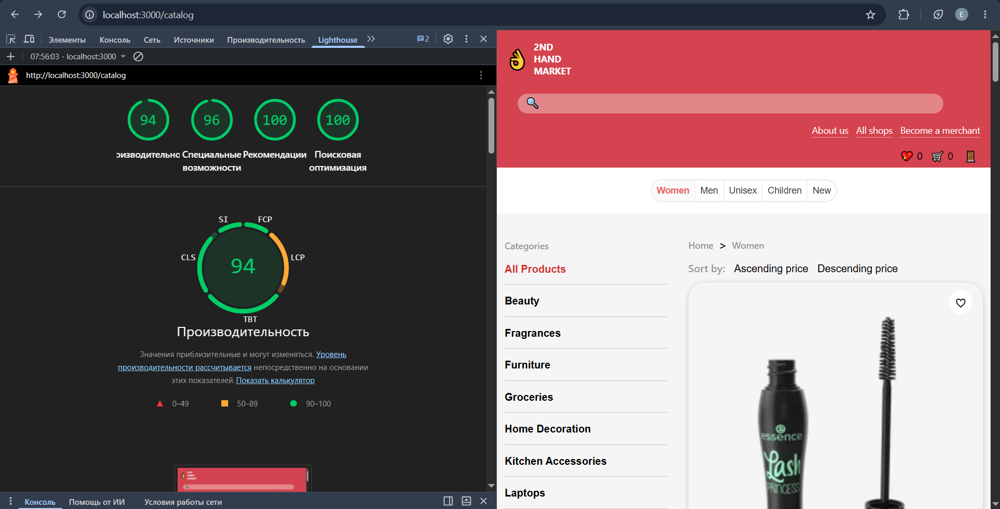

# React E-Commerce SPA

Responsive e-commerce SPA built during internship using React, Redux Toolkit, RTK Query, and Webpack.

The application provides authentication, product catalog browsing, search, filtering, sorting, pagination, and detailed product pages powered by the DummyJSON API.

## Live Demo

[Open Application](https://react-ecommerce-spa-tau.vercel.app/)

## Tech Stack

### Core Technologies

- React 19
- React Router 7
- Redux Toolkit
- RTK Query
- React Hook Form
- React Toastify
- DummyJSON API

### Development Tools

- Webpack 5
- Babel
- ESLint
- Prettier
- Husky

## General Project Requirements

### Functional Scope

- At least 3 application pages
- Client-side routing with React Router
- Global state management with Redux Toolkit
- Data fetching and caching with RTK Query
- Responsive layout for mobile and desktop devices

### Project Constraints

- No Create React App
- No UI component libraries for the main interface
- Modular and maintainable project structure
- Functional React components only
- React Hooks for state and side effects
- Clear separation of UI and business logic

### Quality Requirements

- Clean and readable code
- Consistent formatting and code style
- ESLint and Prettier integration
- Git hooks with Husky
- Structured commit messages

### Delivery Requirements

- Source code hosted on GitHub
- Pull Request workflow
- Production deployment on Vercel

## Functionality

### Authentication

- Login using DummyJSON authentication API
- Client-side form validation with React Hook Form
- Password visibility toggle
- Session persistence via Local Storage
- Logout functionality

### Product Catalog

- Product listing with image, title, price, and rating
- Search by product title
- Category filtering
- Product sorting
- Pagination
- URL-driven state management
- Loading, empty, and error states

### Product Details

- Detailed product information
- Product image gallery with thumbnails
- Image navigation controls
- Breadcrumb navigation
- Back navigation
- Product pricing information
- Customer reviews section

## Lighthouse Audit

The application was audited using Google Lighthouse.

- Performance: 94
- Accessibility: 96
- Best Practices: 100
- SEO: 100



## How to Run Project

Install dependencies:

```bash
npm install
```

Start development server:

```bash
npm start
```

Open in browser:

```text
http://localhost:3000
```

## Available Scripts

Run ESLint:

```bash
npm run lint
```

Automatically fix lint issues:

```bash
npm run lint:fix
```

Check formatting:

```bash
npm run format:check
```

Format project files:

```bash
npm run format
```

Build production bundle:

```bash
npm run build
```
