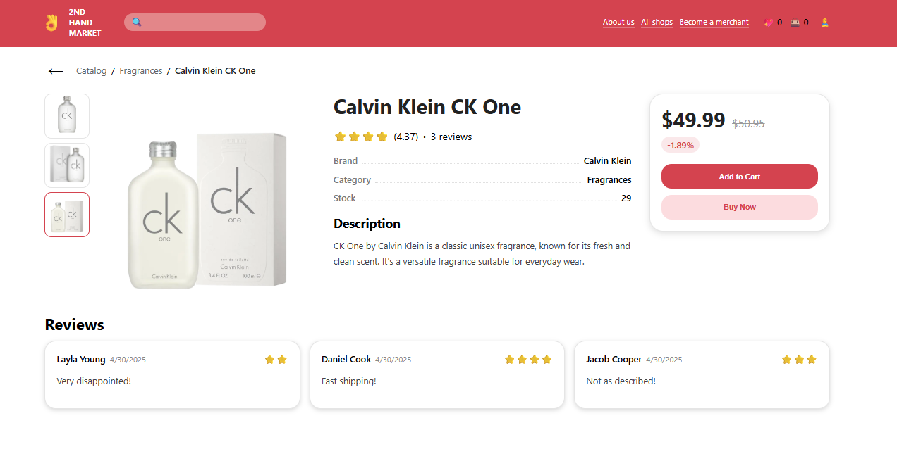

# Product Details Page Requirements

## User Story

As a visitor,

I want to view detailed information about a selected product, browse its images, read customer reviews and add product to cart or buy.

---

## API Calls

### Get Product Details

GET `/products/:id`

Returns:

- product information;
- product images;
- product price information;
- product reviews.

API provider:

- DummyJSON

---

## User Interface

Reference:



---

## Acceptance Criteria

### AC-1

Product Details page is available at:

```text
/catalog/:productId
```

---

### AC-2

User can view product information.

#### AC-2.1

Product title is displayed.

#### AC-2.2

Product description is displayed.

#### AC-2.3

Product category is displayed.

#### AC-2.4

Product brand is displayed.

#### AC-2.5

Product rating is displayed.

#### AC-2.6

Product stock information is displayed.

---

### AC-3

User can navigate using breadcrumbs.

#### AC-3.1

Breadcrumbs are displayed above the product content.

#### AC-3.2

Breadcrumbs contain:

```text
Catalog / Category / Product
```

#### AC-3.3

Catalog breadcrumb navigates to:

```text
/catalog
```

#### AC-3.4

Category breadcrumb navigates to catalog page with the selected category filter applied.

---

### AC-4

User can return to the catalog page.

#### AC-4.1

Back button is displayed.

#### AC-4.2

Clicking the Back button returns the user to the catalog page.

---

### AC-5

User can browse product images.

#### AC-5.1

Main product image is displayed.

#### AC-5.2

Product image thumbnails are displayed.

#### AC-5.3

User can switch images by pointing the mouse cursor at the thumbnails.

#### AC-5.4

User can switch images using previous and next controls.

#### AC-5.5

Currently selected image is visually highlighted in the thumbnails list.

---

### AC-6

User can view product pricing information.

#### AC-6.1

Current product price is displayed.

#### AC-6.2

The price without discount percentage is shown crossed out.

#### AC-6.3

Discount percentage is displayed when available.

#### AC-6.4

Add to Cart button is displayed.

#### AC-6.5

Buy Now button is displayed.

---

### AC-7

User can view product reviews.

#### AC-7.1

Product reviews are displayed as cards.

#### AC-7.2

Each review card displays:

- reviewer name;
- review date.
- rating;
- review text;

#### AC-7.3

If a product has no reviews, an appropriate message is displayed.

---

### AC-8

Loading and error states are displayed.

#### AC-8.1

Loading state is displayed while product data is being fetched.

#### AC-8.2

API errors are displayed to the user.
