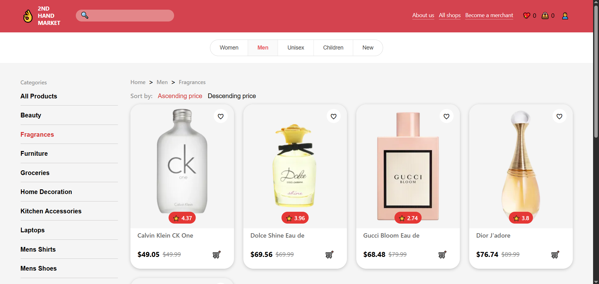

# Catalog Page Requirements

## User Story

As a visitor,

I want to browse products in the catalog, view detailed information about them, search for products, filter and sort results, and navigate through pages of products.

---

## API Calls

### Get Products

GET `/products`

Returns:

- products list;
- total number of products;
- pagination information.

Supports:

- pagination via `limit` and `skip`;
- sorting via `sortBy` and `order`.

### Search Products

GET `/products/search?q=...`

Returns:

- products matching the search query;
- total number of matched products;
- pagination information.

### Get Categories

GET `/products/categories`

Returns:

- available product categories.

### Get Products By Category

GET `/products/category/:category`

Returns:

- products belonging to the selected category.

### Get Product Details

GET `/products/:id`

Returns:

- full product information for the details page.

API provider:

- DummyJSON

---

## User Interface

Reference:



---

## Acceptance Criteria

### AC-1

Catalog page is available at:

```text
/catalog
```

The home route:

```text
/
```

redirects to:

```text
/catalog
```

---

### AC-2

User can browse products.

#### AC-2.1

Products are displayed as cards.

#### AC-2.2

Each product card displays:

- product image;
- product title;
- product price;
- product rating.

#### AC-2.3

User can open the product details page by clicking a product card.

---

### AC-3

User can search products.

#### AC-3.1

Search input is available in the page header.

#### AC-3.2

Search is debounced.

#### AC-3.3

Search query is stored in URL query parameters.

#### AC-3.4

Search is performed across all products.

#### AC-3.5

If a search query is entered, the currently selected category filter is cleared.

#### AC-3.6

If no products match the search query, a "No products found" message is displayed.

---

### AC-4

User can filter products.

#### AC-4.1

Products can be filtered by category.

#### AC-4.2

Selected filters are stored in URL query parameters.

#### AC-4.3

Filters remain applied after page refresh.

---

### AC-5

User can sort products.

#### AC-5.1

Sorting by price ascending is available.

#### AC-5.2

Sorting by price descending is available.

#### AC-5.3

Selected sorting option is stored in URL query parameters.

#### AC-5.4

Sorting remains applied after page refresh.

---

### AC-6

User can navigate through pages of products.

#### AC-6.1

Pagination controls are displayed.

#### AC-6.2

User can change the current page.

#### AC-6.3

User can select the number of products displayed per page.

#### AC-6.4

Current page and page size are stored in URL query parameters.

#### AC-6.5

Pagination remains applied after page refresh.

---

### AC-7

Loading and error states are displayed.

#### AC-7.1

Loading state is displayed while products are being fetched.

#### AC-7.2

Loading state is displayed while categories are being fetched.

#### AC-7.3

API errors are displayed to the user.
